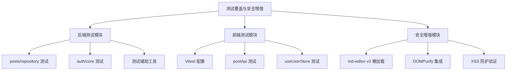
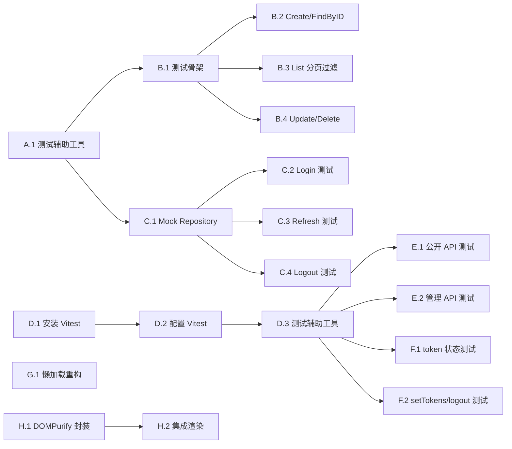

# 功能规划：测试覆盖与安全增强

**规划时间**：2026-03-09
**预估工作量**：18 任务点

---

## 1. 功能概述

### 1.1 目标

为博客系统补充单元测试覆盖并增强安全防护，确保代码质量和用户数据安全。

### 1.2 范围

**包含**：
- 后端 `posts/repository` 模块单元测试（CRUD、分页、过滤）
- 后端 `auth/core` 模块单元测试（登录、刷新令牌、登出）
- 前端 Vitest 测试框架配置
- 前端 `postApi` API 调用测试（mock axios）
- 前端 `useUserStore` 状态管理测试
- EditorView.vue 中 md-editor-v3 懒加载优化
- DOMPurify 依赖集成与 Markdown 净化

**不包含**：
- E2E 端到端测试
- 后端 transport 层（handler）测试
- 前端组件渲染测试
- 性能测试与压力测试

### 1.3 技术约束

| 约束项 | 说明 |
|--------|------|
| 后端测试框架 | Go testing 标准库 |
| 后端 Mock 方案 | 使用接口 mock 或测试数据库 |
| 前端测试框架 | Vitest + @vue/test-utils |
| 前端 Mock 方案 | vi.fn() + vi.mock() |
| TypeScript | 严格模式，禁止 any |
| 安全规范 | DOMPurify 净化 HTML，defineAsyncComponent 懒加载 |

---

## 2. WBS 任务分解

### 2.1 分解结构图



### 2.2 任务清单

---

#### 模块 A：后端测试辅助工具（2 任务点）

**文件**: `backend/internal/testutil/`

- [ ] **任务 A.1**：创建测试数据库辅助工具（2 点）
  - **输入**：pgx/v5 连接池配置
  - **输出**：`testutil/db.go` 提供 `NewTestDB()` 函数
  - **关键步骤**：
    1. 创建 `internal/testutil/db.go`
    2. 实现 `NewTestDB()` 返回 `*pgxpool.Pool`
    3. 从环境变量 `TEST_DATABASE_URL` 读取连接串
    4. 实现 `CleanupTables(ctx, tables...)` 清理测试数据
    5. 使用 `t.Cleanup()` 确保测试后自动清理

---

#### 模块 B：posts/repository 测试（5 任务点）

**文件**: `backend/internal/modules/posts/repository/postgres_test.go`

- [ ] **任务 B.1**：创建测试文件骨架和测试数据（1 点）
  - **输入**：`postgres.go` 源码
  - **输出**：`postgres_test.go` 基础结构
  - **关键步骤**：
    1. 创建 `postgres_test.go`
    2. 定义 `TestMain(m *testing.M)` 初始化测试数据库
    3. 创建 `setupTestData()` 插入测试分类、标签、文章
    4. 定义 `TestPost` 辅助函数验证文章字段

- [ ] **任务 B.2**：测试 Create 和 FindByID（1 点）
  - **输入**：测试数据库、测试数据
  - **输出**：`TestPostgresRepo_Create`、`TestPostgresRepo_FindByID`
  - **关键步骤**：
    1. 测试创建文章成功
    2. 测试 slug 重复返回 ErrConflict
    3. 测试 FindByID 返回正确文章及关联标签
    4. 测试 FindByID 不存在返回 ErrNotFound

- [ ] **任务 B.3**：测试 List 分页和过滤（2 点）
  - **输入**：测试数据库、多篇测试文章
  - **输出**：`TestPostgresRepo_List`
  - **关键步骤**：
    1. 测试分页（page/size）正确返回
    2. 测试 status 过滤
    3. 测试 category 过滤
    4. 测试 tag 过滤
    5. 测试 query 全文搜索
    6. 测试组合过滤条件

- [ ] **任务 B.4**：测试 Update、UpdateStatus、Delete（1 点）
  - **输入**：测试数据库
  - **输出**：`TestPostgresRepo_Update`、`TestPostgresRepo_UpdateStatus`、`TestPostgresRepo_Delete`
  - **关键步骤**：
    1. 测试更新文章各字段
    2. 测试更新状态（draft -> published）
    3. 测试 published_at 自动设置
    4. 测试删除文章成功
    5. 测试标签关联同步

---

#### 模块 C：auth/core 测试（4 任务点）

**文件**: `backend/internal/modules/auth/core/service_test.go`

- [ ] **任务 C.1**：创建 Mock Repository（1 点）
  - **输入**：`Repository` 接口定义
  - **输出**：`mock_repository.go`（或内联在 test 文件）
  - **关键步骤**：
    1. 定义 `MockRepository` 结构体
    2. 实现所有接口方法
    3. 使用函数字段支持自定义行为
    4. 支持调用次数验证

- [ ] **任务 C.2**：测试 Login 成功和失败场景（1 点）
  - **输入**：Mock Repository、Mock JWT Manager
  - **输出**：`TestService_Login`
  - **关键步骤**：
    1. 测试正确邮箱密码登录成功
    2. 测试邮箱不存在返回 ErrUnauthorized
    3. 测试密码错误返回 ErrUnauthorized
    4. 验证 token 正确生成
    5. 验证 UpdateLastLogin 被调用

- [ ] **任务 C.3**：测试 Refresh Token 流程（1 点）
  - **输入**：Mock Repository
  - **输出**：`TestService_Refresh`
  - **关键步骤**：
    1. 测试有效 refresh token 刷新成功
    2. 测试无效 refresh token 返回 ErrUnauthorized
    3. 验证旧 token 被 revoke
    4. 验证新 token 对正确生成

- [ ] **任务 C.4**：测试 Logout 流程（1 点）
  - **输入**：Mock Repository
  - **输出**：`TestService_Logout`
  - **关键步骤**：
    1. 测试登出调用 RevokeRefreshToken
    2. 验证 token hash 计算正确
    3. 测试错误传播

---

#### 模块 D：前端测试基础设施（3 任务点）

**文件**: `frontend/vite.config.ts`, `frontend/vitest.config.ts`, `frontend/package.json`

- [ ] **任务 D.1**：安装 Vitest 和测试依赖（1 点）
  - **输入**：package.json
  - **输出**：更新后的 package.json
  - **关键步骤**：
    1. 安装 `vitest`、`@vue/test-utils`、`happy-dom`
    2. 添加 `test` 脚本到 package.json
    3. 安装 `@vitest/coverage-v8`（可选覆盖率）

- [ ] **任务 D.2**：配置 Vitest（1 点）
  - **输入**：vite.config.ts
  - **输出**：`vitest.config.ts` 或扩展 vite.config.ts
  - **关键步骤**：
    1. 创建 `vitest.config.ts`
    2. 配置 `environment: 'happy-dom'`
    3. 配置 `include: ['src/**/*.spec.ts']`
    4. 配置 `coverage` 报告
    5. 配置 alias 与 vite.config.ts 一致

- [ ] **任务 D.3**：创建测试辅助工具（1 点）
  - **输入**：request.ts、types
  - **输出**：`src/test/utils.ts`
  - **关键步骤**：
    1. 创建 `src/test/utils.ts`
    2. 实现 `createMockResponse<T>(data)` 辅助函数
    3. 实现 `mockAxios` 工具函数
    4. 实现 `createPiniaWithRouter()` 测试用 Pinia 实例

---

#### 模块 E：前端 API 测试（2 任务点）

**文件**: `frontend/src/api/post.spec.ts`

- [ ] **任务 E.1**：测试 postApi 公开接口（1 点）
  - **输入**：`src/api/post.ts`
  - **输出**：`src/api/post.spec.ts`
  - **关键步骤**：
    1. Mock axios request 实例
    2. 测试 `list(filter)` 调用正确 URL 和参数
    3. 测试 `getBySlug(slug)` 调用正确 URL
    4. 验证返回类型正确

- [ ] **任务 E.2**：测试 postApi 管理接口（1 点）
  - **输入**：`src/api/post.ts`
  - **输出**：`src/api/post.spec.ts` 补充
  - **关键步骤**：
    1. 测试 `create(payload)` 发送正确 body
    2. 测试 `update(id, payload)` 发送正确 body
    3. 测试 `updateStatus(id, status)` 调用 PATCH
    4. 测试 `delete(id)` 调用 DELETE

---

#### 模块 F：前端 Store 测试（2 任务点）

**文件**: `frontend/src/store/user.spec.ts`

- [ ] **任务 F.1**：测试 token 存储和认证状态（1 点）
  - **输入**：`src/store/user.ts`
  - **输出**：`src/store/user.spec.ts`
  - **关键步骤**：
    1. Mock localStorage
    2. 测试初始状态从 localStorage 恢复
    3. 测试 `isAuthenticated` computed 正确计算
    4. 测试空 token 时 isAuthenticated 为 false

- [ ] **任务 F.2**：测试 setTokens 和 logout（1 点）
  - **输入**：`src/store/user.ts`
  - **输出**：`src/store/user.spec.ts` 补充
  - **关键步骤**：
    1. 测试 `setTokens(pair)` 更新 state 和 localStorage
    2. 测试 `logout()` 清除 state 和 localStorage
    3. Mock router 测试 logout 跳转
    4. 测试连续调用 setTokens 正确覆盖

---

#### 模块 G：md-editor-v3 懒加载（1 任务点）

**文件**: `frontend/src/views/admin/EditorView.vue`

- [ ] **任务 G.1**：重构为 defineAsyncComponent（1 点）
  - **输入**：当前 `EditorView.vue`
  - **输出**：优化后的 `EditorView.vue`
  - **关键步骤**：
    1. 移除 `import { MdEditor } from 'md-editor-v3'`
    2. 使用 `defineAsyncComponent` 懒加载 MdEditor
    3. 保留样式导入（`md-editor-v3/lib/style.css` 可考虑异步）
    4. 添加 loading 状态组件
    5. 添加 error 状态处理（加载失败回退）
    6. 验证编辑器功能正常

---

#### 模块 H：DOMPurify XSS 防护（2 任务点）

**文件**: `frontend/src/utils/sanitize.ts`, `frontend/package.json`

- [ ] **任务 H.1**：安装并封装 DOMPurify（1 点）
  - **输入**：package.json
  - **输出**：`src/utils/sanitize.ts`
  - **关键步骤**：
    1. 安装 `dompurify` 和 `@types/dompurify`
    2. 创建 `src/utils/sanitize.ts`
    3. 封装 `sanitizeHtml(dirty: string): string` 函数
    4. 配置允许的标签白名单（保留 markdown 常用标签）
    5. 配置允许的属性白名单（href, src, alt 等）
    6. 添加单元测试 `sanitize.spec.ts`

- [ ] **任务 H.2**：集成到 Markdown 渲染（1 点）
  - **输入**：渲染 Markdown 的组件
  - **输出**：更新后的渲染组件
  - **关键步骤**：
    1. 找到所有渲染 `content_html_cached` 的位置
    2. 在 `v-html` 绑定前调用 `sanitizeHtml()`
    3. 更新 `PostDetailView.vue`（前台文章详情）
    4. 验证 XSS 攻击向量被过滤
    5. 验证正常 Markdown 渲染不受影响

---

## 3. 依赖关系

### 3.1 依赖图



### 3.2 依赖说明

| 任务 | 依赖于 | 原因 |
|------|--------|------|
| B.1 | A.1 | 需要测试数据库辅助工具 |
| B.2, B.3, B.4 | B.1 | 共享测试骨架和 setup |
| C.2, C.3, C.4 | C.1 | 需要 Mock Repository |
| E.1, E.2 | D.3 | 需要测试辅助工具 |
| F.1, F.2 | D.3 | 需要测试辅助工具 |
| H.2 | H.1 | 需要先封装 DOMPurify |

### 3.3 并行任务

以下任务可以并行开发：

**后端并行组**：
- A.1 (测试辅助工具) || G.1 (懒加载) || D.1 (安装 Vitest)

**后端测试并行组**（A.1 完成后）：
- B.1 || C.1

**前端测试并行组**（D.3 完成后）：
- E.1 || E.2 || F.1 || F.2

**安全增强并行组**：
- G.1 || H.1

---

## 4. 实施建议

### 4.1 技术选型

| 需求 | 推荐方案 | 理由 |
|------|----------|------|
| 后端 Mock | 手动实现 Mock Repository | 简单场景无需 testify/mock，保持零外部依赖 |
| 前端测试环境 | happy-dom | 比 jsdom 更快，Vue 3 兼容性好 |
| DOMPurify 配置 | 保守白名单 | 仅允许安全的 HTML 标签和属性 |

### 4.2 DOMPurify 白名单配置建议

```typescript
// src/utils/sanitize.ts
import DOMPurify from 'dompurify'

const ALLOWED_TAGS = [
  'p', 'br', 'strong', 'em', 'u', 's', 'del',
  'h1', 'h2', 'h3', 'h4', 'h5', 'h6',
  'ul', 'ol', 'li',
  'blockquote', 'pre', 'code',
  'a', 'img',
  'table', 'thead', 'tbody', 'tr', 'th', 'td',
  'hr', 'div', 'span'
]

const ALLOWED_ATTR = [
  'href', 'src', 'alt', 'title', 'class',
  'target', 'rel'
]

export function sanitizeHtml(dirty: string): string {
  return DOMPurify.sanitize(dirty, {
    ALLOWED_TAGS,
    ALLOWED_ATTR,
    ADD_ATTR: ['target'], // 允许 target="_blank"
  })
}
```

### 4.3 EditorView 懒加载示例

```typescript
// EditorView.vue
<script setup lang="ts">
import { defineAsyncComponent, ref } from 'vue'

const MdEditor = defineAsyncComponent(() =>
  import('md-editor-v3').then(mod => mod.MdEditor)
)

const editorLoading = ref(true)
</script>

<template>
  <Suspense>
    <template #default>
      <MdEditor v-model="form.content_md" ... />
    </template>
    <template #fallback>
      <div class="loading-editor">Loading editor...</div>
    </template>
  </Suspense>
</template>
```

### 4.4 潜在风险

| 风险 | 影响 | 缓解措施 |
|------|------|----------|
| 测试数据库污染 | 中 | 使用独立测试数据库，每个测试后清理 |
| Mock 与实现不同步 | 中 | Mock 基于接口定义，定期同步检查 |
| DOMPurify 过度过滤 | 低 | 编写测试验证常用 Markdown 语法正常 |
| 懒加载导致首屏延迟 | 低 | 添加 loading 状态，缓存加载结果 |

### 4.5 测试策略

- **单元测试**：
  - 后端：所有 repository 和 service 方法
  - 前端：API 调用、Store 状态变更、sanitize 工具

- **边界测试**：
  - 空输入、空字符串
  - 超长字符串
  - 特殊字符和 Unicode

- **安全测试**：
  - XSS 攻击向量：`<script>alert(1)</script>`
  - 事件处理器：``
  - javascript 协议：`<a href="javascript:alert(1)">`

---

## 5. 验收标准

功能完成需满足以下条件：

- [ ] **后端测试通过**
  ```bash
  cd backend && make test
  # 输出: PASS, 覆盖率 >= 70%
  ```

- [ ] **前端测试通过**
  ```bash
  cd frontend && pnpm test
  # 输出: all tests passed
  ```

- [ ] **TypeScript 类型检查通过**
  ```bash
  cd frontend && pnpm type-check
  # 无错误
  ```

- [ ] **安全增强验证**
  - EditorView.vue 中无同步 import md-editor-v3
  - XSS 攻击向量被过滤：
    ```typescript
    sanitizeHtml('<script>alert(1)</script>') === ''
    sanitizeHtml('') === ''
    ```

- [ ] **无新增 lint 错误**
  ```bash
  cd backend && make lint
  ```

---

## 6. 文件变更清单

### 新增文件

| 文件路径 | 说明 |
|----------|------|
| `backend/internal/testutil/db.go` | 测试数据库辅助工具 |
| `backend/internal/modules/posts/repository/postgres_test.go` | 文章仓库测试 |
| `backend/internal/modules/auth/core/service_test.go` | 认证服务测试 |
| `backend/internal/modules/auth/core/mock_repository.go` | Mock Repository（可选） |
| `frontend/vitest.config.ts` | Vitest 配置 |
| `frontend/src/test/utils.ts` | 前端测试辅助工具 |
| `frontend/src/api/post.spec.ts` | API 测试 |
| `frontend/src/store/user.spec.ts` | Store 测试 |
| `frontend/src/utils/sanitize.ts` | DOMPurify 封装 |
| `frontend/src/utils/sanitize.spec.ts` | DOMPurify 测试 |

### 修改文件

| 文件路径 | 变更说明 |
|----------|----------|
| `frontend/package.json` | 添加 vitest 等依赖和 test 脚本 |
| `frontend/src/views/admin/EditorView.vue` | md-editor-v3 懒加载 |
| `frontend/src/views/front/PostDetailView.vue` | 集成 DOMPurify |

---

## 7. 后续优化方向（Phase 2）

- **覆盖率提升**：增加 handler 层测试、前端组件测试
- **E2E 测试**：引入 Playwright 进行端到端测试
- **CI/CD 集成**：GitHub Actions 自动运行测试
- **基准测试**：后端关键路径性能基准
- **测试数据工厂**：引入 factory 模式生成测试数据
