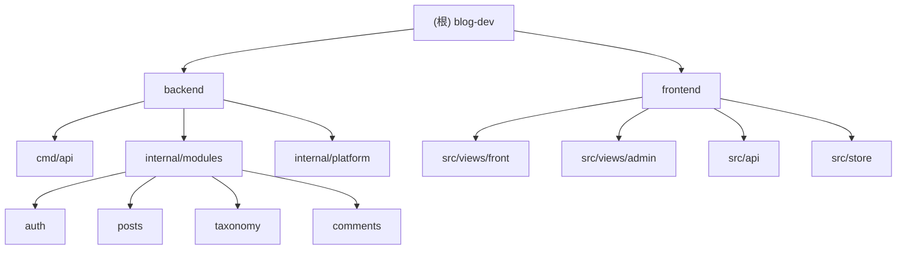

# CLAUDE.md — AI 开发规范

> 最后更新：2026-03-09

本文档为 AI 助手（Claude Code 等）在此项目中工作的规范约束。

## 项目概述

前后端分离博客系统：
- **前端**：`frontend/` — Vue 3 + TypeScript + Vite + UnoCSS
- **后端**：`backend/` — Go + Gin + PostgreSQL + Redis

## 架构总览

```
┌─────────────────┐     ┌─────────────────┐
│   Frontend      │     │    Backend      │
│   (Vue 3)       │────▶│    (Go/Gin)     │
│   :5173         │     │    :8080        │
└─────────────────┘     └────────┬────────┘
                                 │
                    ┌────────────┼────────────┐
                    ▼            ▼            ▼
              ┌──────────┐ ┌──────────┐ ┌──────────┐
              │PostgreSQL│ │  Redis   │ │  JWT     │
              │   :5432  │ │   :6379  │ │  Auth    │
              └──────────┘ └──────────┘ └──────────┘
```

## 模块结构图



## 模块索引

| 模块 | 路径 | 语言 | 入口 | 职责 |
|------|------|------|------|------|
| Backend | `backend/` | Go | `cmd/api/main.go` | RESTful API 服务 |
| Frontend | `frontend/` | TypeScript/Vue | `src/main.ts` | 用户界面 |

## 架构约束

### 全局规则

1. **外部服务写入**：不得直接操作数据库或 Redis，必须通过后端 API
2. **环境变量**：敏感信息（密钥、密码）只写入 `.env`，不进代码
3. **提交规范**：使用 Conventional Commits（`feat:`, `fix:`, `docs:`, `refactor:` 等）

### 后端约束（backend/）

**目录规范**：
- 领域逻辑 → `internal/modules/<module>/core/`
- 数据库操作 → `internal/modules/<module>/repository/`
- HTTP 处理 → `internal/modules/<module>/transport/http/`
- 平台基础设施 → `internal/platform/`
- 跨模块共享 → `internal/modules/shared/`

**代码规范**：
- 使用 `pgx/v5`，禁止使用 `database/sql` 原生接口
- 错误处理：所有 error 必须 wrap 后返回（`fmt.Errorf("...: %w", err)`）
- 日志：使用 `zap`，禁止使用 `fmt.Println` 或标准 `log`
- 验证：使用 `go-playground/validator/v10`，DTO 必须打标签
- 测试：新增 repository 和 service 必须附带单元测试

**API 规范**：
- 版本前缀：`/api/v1/`
- 公开 API：`/api/v1/` 下无需鉴权
- 管理 API：`/api/v1/admin/` 下需要 JWT Bearer Token
- 统一响应格式：`{ "code": 200, "data": {}, "message": "success" }`
- 错误响应格式：`{ "code": 4xx/5xx, "message": "error description" }`

**禁止事项**：
- 禁止在 handler 中直接写 SQL
- 禁止跨模块直接调用 repository
- 禁止在 transport 层出现业务逻辑

### 前端约束（frontend/）

**TypeScript 规范**：
- 严格模式：`tsconfig.json` 中 `strict: true`
- 所有 `.vue` 文件使用 `<script setup lang="ts">`
- 禁止使用 `any`，未知类型用 `unknown`
- API 响应必须定义 TypeScript 接口

**目录规范**：
- 前台页面 → `src/views/front/`
- 后台页面 → `src/views/admin/`
- 前台组件 → `src/components/front/`
- 后台组件 → `src/components/admin/`
- 通用组件 → `src/components/common/`
- API 调用 → `src/api/`（调用 `src/utils/request.ts`）
- 状态管理 → `src/store/`（Pinia，Setup 语法）

**样式规范**：
- 样式使用 UnoCSS 原子类，禁止在 `<style>` 中写大量 CSS
- 主题色通过 `uno.config.ts` 的 `theme.colors.primary` 定义
- 文章内容渲染使用 `prose` class（UnoCSS Typography preset）

**性能规范**：
- `md-editor-v3` 只能在 `/admin/` 路由下使用，且必须 `defineAsyncComponent` 懒加载
- 所有路由组件使用 `() => import(...)` 懒加载
- 禁止在前台（FrontLayout）中引入后台专用依赖

**安全规范**：
- 渲染 Markdown HTML 前必须使用 DOMPurify 净化，防止 XSS
- 禁止将 JWT Token 存入 `<script>` 标签或 URL 参数

## 数据库迁移规范

- 迁移文件在 `backend/migrations/` 目录
- 命名格式：`NNNN_description.up.sql` / `NNNN_description.down.sql`
- 每个 `.up.sql` 必须有对应的 `.down.sql`（回滚操作）
- 禁止修改已执行的迁移文件，需要变更则新增迁移

## 运行与开发

### 开发环境

```bash
# 1. 启动数据库和缓存
make dev

# 2. 启动后端（新终端）
cd backend && make run

# 3. 启动前端（新终端）
cd frontend && pnpm dev
```

### 生产部署

```bash
# 初始化环境变量
make init-env
# 编辑 .env 文件，填写必要配置

# 启动所有服务
make prod
```

### 常用命令

```bash
# 后端
cd backend && make run          # 启动后端
cd backend && make test         # 运行测试
cd backend && make migrate-up   # 执行迁移
cd backend && make lint         # 代码检查

# 前端
cd frontend && pnpm dev         # 启动前端
cd frontend && pnpm build       # 构建生产包
cd frontend && pnpm type-check  # TypeScript 类型检查

# Docker
docker compose up -d            # 启动所有服务
docker compose down             # 停止所有服务
docker compose logs -f backend  # 查看后端日志
```

## 测试策略

### 当前状态

| 模块 | 单元测试 | 集成测试 | E2E 测试 |
|------|----------|----------|----------|
| Backend | 缺失 | 缺失 | - |
| Frontend | 缺失 | 缺失 | 缺失 |

### 建议补充

1. **后端单元测试**
   - `backend/internal/modules/*/repository/*_test.go`
   - `backend/internal/modules/*/core/*_test.go`

2. **前端单元测试**
   - 配置 Vitest
   - `frontend/src/api/*.spec.ts`
   - `frontend/src/store/*.spec.ts`

## 编码规范

### Git 提交规范

```
feat: 新功能
fix: 修复 bug
docs: 文档更新
refactor: 重构
test: 测试相关
chore: 构建/工具相关
```

### 代码风格

- Go: 使用 `golangci-lint`
- TypeScript: 遵循 `strict` 模式
- 命名：驼峰式（TS）、下划线（Go/SQL）

## AI 使用指引

### 工作前必读

1. 阅读本文档了解项目约束
2. 阅读相关模块的 `CLAUDE.md`
3. 检查 `.claude/index.json` 了解项目结构

### 代码修改原则

1. 遵循现有架构约束，不随意跨层调用
2. 新增功能需同时更新文档
3. 敏感信息只写入 `.env`
4. 数据库变更必须创建迁移文件

### 常见任务

**添加新的 API 端点**：
1. 在 `internal/modules/<module>/core/entity.go` 定义 DTO
2. 在 `internal/modules/<module>/core/service.go` 添加业务逻辑
3. 在 `internal/modules/<module>/repository/postgres.go` 添加数据访问
4. 在 `internal/modules/<module>/transport/http/handler.go` 添加处理函数
5. 在 `internal/app/router.go` 注册路由

**添加新的前端页面**：
1. 在 `src/types/index.ts` 定义类型
2. 在 `src/api/` 添加 API 调用
3. 在 `src/views/` 创建页面组件
4. 在 `src/router/index.ts` 注册路由

## 变更记录 (Changelog)

| 日期 | 变更 |
|------|------|
| 2026-03-09 | 生成项目架构文档，添加模块结构图，更新运行指引 |
| - | 初始版本：AI 开发规范 |
